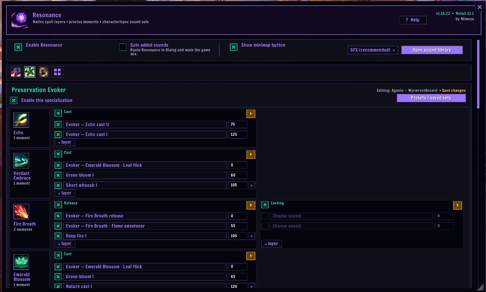
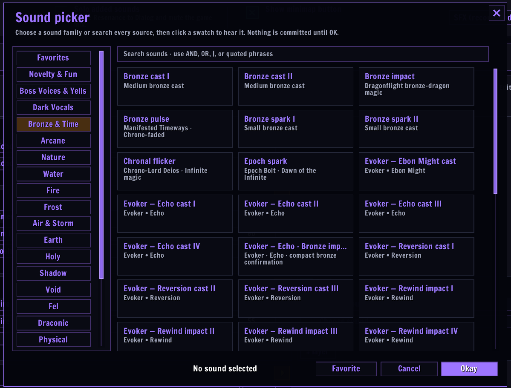
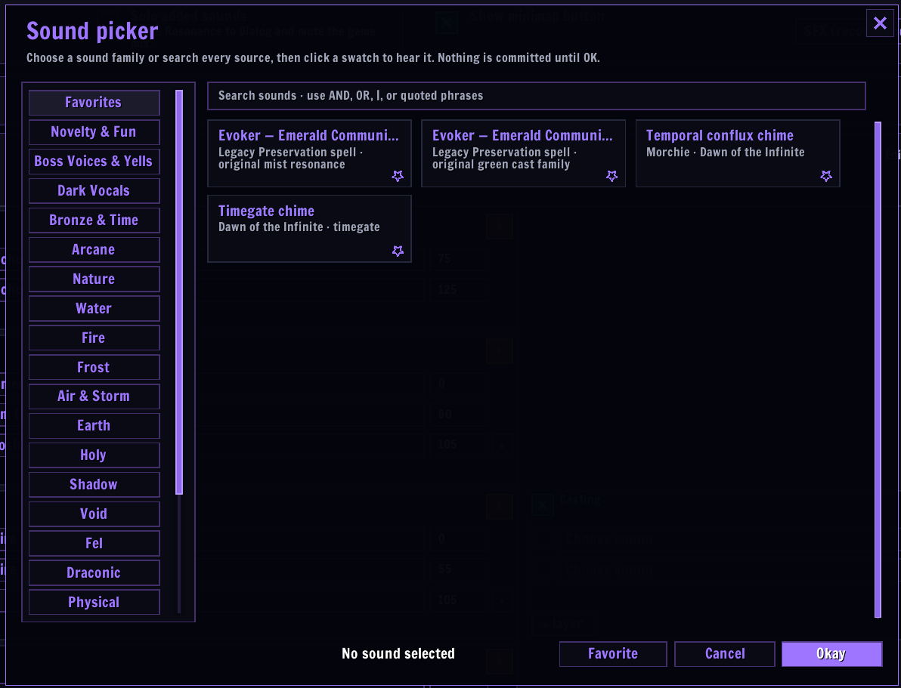
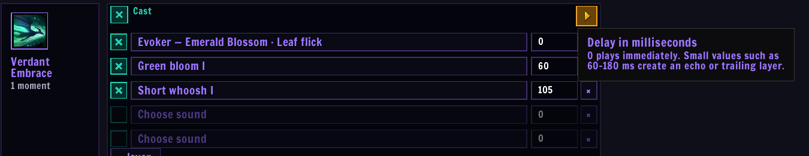
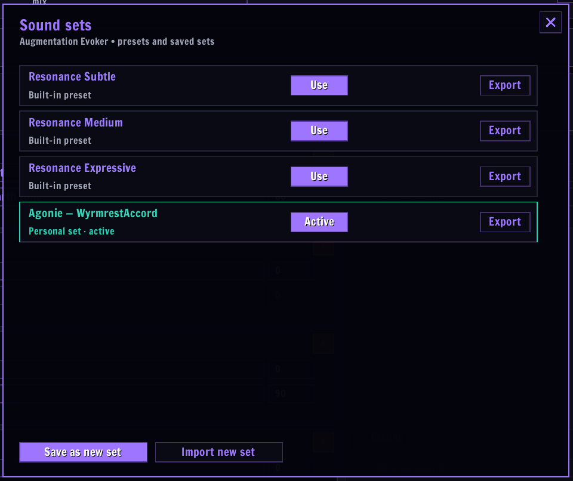

# Resonance

Give your spells a richer sound identity while keeping World of Warcraft's original audio intact during normal play.

Resonance adds carefully chosen sound accents when WoW confirms a successful player spell cast, starts a watched cast or channel, or completes an empowered release. Every current Retail specialization has ready-to-use sound sets, and each editable moment can be changed, layered, delayed, previewed, or disabled.

[Download the latest release](https://github.com/Mimezu/Resonance/releases/latest/download/Resonance.zip)

## Make every specialization sound like yours

- Enable or disable Resonance separately for each specialization.
- Choose which spell moments receive an added sound.
- During normal play, keep Blizzard's spell audio and layer Resonance over it.
- Preview individual moments while you build your sound set.
- Use the included Subtle, Medium, and Expressive presets as a starting point.

Personal sound sets are stored by character and specialization, so each build can have its own sound.

## Browse and preview the sound library

Open any sound slot to browse a curated library of World of Warcraft sounds. Search by name, spell, class, encounter, or description; browse sound families; and click any result to hear it immediately.

Favorite sounds you want to find again quickly. The Favorites view keeps your personal shortlist in one place.

## Build layered spell accents

Each spell moment can use several sound layers. Small millisecond delays let you build an echo, a trailing texture, or a more expressive sequence from multiple sounds.

## Save, switch, and share sound sets

Start with a built-in preset or save your own set for a character and specialization. You can switch sets at any time, export one to share with a friend playing the same specialization, or import a set someone sends you.

Exports use the compact, self-contained `RES3F` share format: it preserves spell-rule and sound IDs, layers, delays, and toggles without depending on a fixed catalog order. This keeps shared sets resilient when Resonance adds sounds or Blizzard changes spells. Older `RES1` share codes remain importable.

## Useful extras

- A movable, resizable editor with a guided tutorial and built-in help.
- Optional minimap and AddOn Compartment access.
- Solo audition mode temporarily mutes SFX, music, and ambience while routing Resonance to Dialog, then restores the previous mix when you turn it off.
- Sound playback uses Blizzard audio already included with the game; Resonance does not bundle replacement audio files.

## Installation

1. Download `Resonance.zip` from the [latest release](https://github.com/Mimezu/Resonance/releases/latest).
2. Extract the `Resonance` folder into `World of Warcraft/_retail_/Interface/AddOns/`.
3. Enable Resonance on the character-selection AddOns screen.
4. Type `/res` in game to open the editor.

## Commands

- `/res` — open Resonance.
- `/res help` — open help.
- `/res tutorial` — start the guided tutorial.
- `/res on`, `/res off`, `/res toggle` — control the addon.
- `/res test` — preview an active sound cue, or open the library when no cue is active.
- `/res solo` — toggle solo audition mode.
- `/res minimap` — show or hide the minimap button.
- `/res reset` — reset Resonance after confirmation.

Resonance is made for Retail World of Warcraft.
